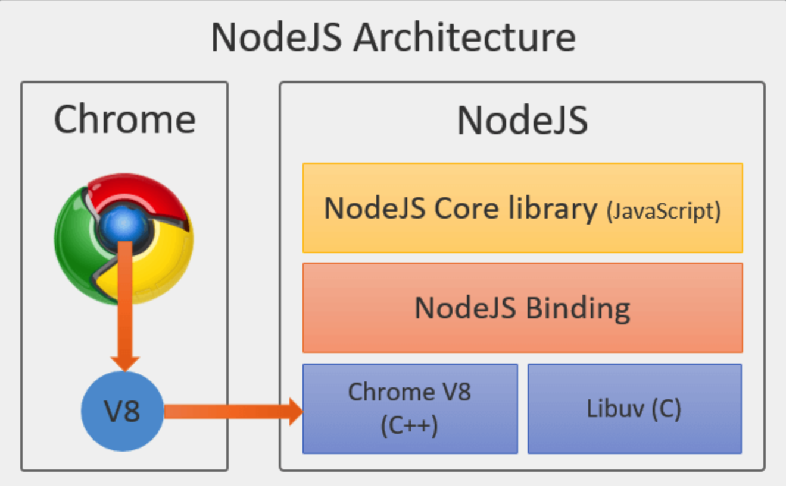
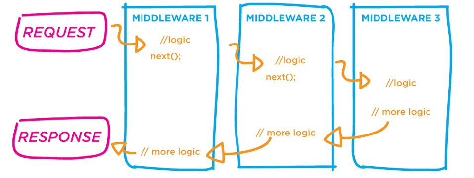

---

@title[Introduction]
### NODE JS
---
@title[what is Node?]
### So, what is Node?
- Open source server framework
- Free
- Runs on various platforms (Windows, Linux, Unix, Mac OS X, etc.)
- Uses JavaScript on the server
---
@title[Why Node.js?]
### Why Node.js?
- Asynchronous programming
- Eliminates the waiting
- Runs single-threaded, non-blocking
---
@title[NodeJs Architecture]
### NodeJs Architecture

     
---

@title[Getting started with Node]
### Getting started with Node
- Download https://nodejs.org/
- Install
- Create a file named "myfirst.js":
- Run `node myfirst.js`

```js
const http = require('http');

http.createServer( (req, res) => {
    res.writeHead(200, {'Content-Type': 'text/html'});
    res.end('Hello World!');
}).listen(8080);
```
---
@title[Node.js Built-in Modules]
### Node.js Built-in Modules
- Http module
- File system
- Event module
- ...

+++

@title[Http Module]
### Http Module

```js
const http = require('http');
const url = require('url');

http.createServer( (req, res) => {
  res.writeHead(200, {'Content-Type': 'text/html'});
  const q = url.parse(req.url, true).query;
  const txt = q.year + " " + q.month;
  res.end(txt);
}).listen(8080);
```
+++

@title[File system]
### File system
- Read/Create/Update/Delete/Rename files
```html
<html>
<body>
<h1>My Header</h1>
<p>My paragraph.</p>
</body>
</html>
```

```js
const http = require('http');
const fs = require('fs');
http.createServer( (req, res) => {
  fs.readFile('demofile1.html', (err, data) => {
    res.writeHead(200, {'Content-Type': 'text/html'});
    res.write(data);
    res.end();
  });
}).listen(8080);
```
+++

@title[Event module]
### Event module
- create-, fire-, and listen for- your own events.
- Instance of an EventEmitter object

```js
const events = require('events');
const eventEmitter = new events.EventEmitter();
//Create an event handler:
const myEventHandler =  () => {
  console.log('I hear a scream!');
}
//Assign the event handler to an event:
eventEmitter.on('scream', myEventHandler);
//Fire the 'scream' event:
eventEmitter.emit('scream');
```
---
@title[NPM]
### NPM 
- Package manager for Node.js packages
- www.npmjs.com.
- Download a Package 

```sh 
npm install upper-case
```
- Using a Package

```js
const upperCase = require('upper-case')
 
upperCase(null)           //=> "" 
upperCase('string')       //=> "STRING" 
```
---

@title[Node.js MongoDB]
### Node.js MongoDB Driver
- Install Mongo
- Install MongoDB Driver 
```sh
npm install mongodb --save
```

- http://mongodb.github.io/node-mongodb-native/3.0/quick-start/quick-start/
- Creating a Database
- Insert a Document

+++ 

@title[Creating a Database]
### Creating a Database 
```js
const MongoClient = require('mongodb').MongoClient;
// Connection URL
const url = 'mongodb://localhost:27017';
// Database Name
const dbName = 'myproject';
// Use connect method to connect to the server
MongoClient.connect(url, function(err, client) {
  console.log("Connected successfully to server");

  const db = client.db(dbName);
  client.close();
});
```
+++ 

@title[Insert a Document]
### Creating a Collection
```js
const MongoClient = require('mongodb').MongoClient;
// Connection URL
const url = 'mongodb://localhost:27017';
// Database Name
const dbName = 'myproject';
// Use connect method to connect to the server
MongoClient.connect(url, function(err, client) {
  console.log("Connected successfully to server");

  const db = client.db(dbName);
  const collection = db.collection('documents');

  collection.insertMany([
    {a : 1}, {a : 2}, {a : 3}
  ], (err, result) => {
    if (err) throw err;
    
    console.log("Inserted 3 documents into the collection");
    client.close();
  });
});
```

---
@title[Node.js - Express Framework]
### Node.js - Express Framework
- Web framework for Node.js
- Middlewares to respond to HTTP Requests.
- Routing table
- View templates

```sh
$ npm install express --save
```
+++ 

@title[Hello world Example]
### Hello world Example

```js
const express = require('express');
const app = express();

app.get('/', (req, res) => {
   res.send('Hello World');
})

const server = app.listen(8081, () => {
   const host = server.address().address
   const port = server.address().port
   
   console.log("Example app listening at http://%s:%s", host, port)
})
```
+++
@title[Basic Routing]
### Basic Routing

```js
const express = require('express');
const app = express();

// This responds with "Hello World" on the homepage
app.get('/', (req, res) => {
   console.log("Got a GET request for the homepage");
   res.send('Hello GET');
})

// This responds a POST request for the homepage
app.post('/', (req, res) => {
   console.log("Got a POST request for the homepage");
   res.send('Hello POST');
})

// This responds a DELETE request for the /del_user page.
app.delete('/del_user', (req, res) => {
   console.log("Got a DELETE request for /del_user");
   res.send('Hello DELETE');
})

// This responds a GET request for the /list_user page.
app.get('/list_user', (req, res) => {
   console.log("Got a GET request for /list_user");
   res.send('Page Listing');
})

// This responds a GET request for abcd, abxcd, ab123cd, and so on
app.get('/ab*cd',(req, res) => {   
   console.log("Got a GET request for /ab*cd");
   res.send('Page Pattern Match');
})

const server = app.listen(8081, () => {

   const host = server.address().address
   const port = server.address().port

   console.log("Example app listening at http://%s:%s", host, port)
})
```
+++

@title[Serving Static Files]
### Serving Static Files
- Built-in middleware `express.static `to serve static files.

```js
const express = require('express');
const app = express();

app.use(express.static('public'));

app.get('/', (req, res) => {
   res.send('Hello World');
})

const server = app.listen(8081, () => {
   const host = server.address().address
   const port = server.address().port

   console.log("Example app listening at http://%s:%s", host, port)

})
```
---
@title[Node.js - Express middleware]
  - https://expressjs.com/en/resources/middleware.html
  - body-parser - Parse HTTP request body
  - cookie-parser - Parse cookie header
  - cors - Enable cross-origin resource sharing (CORS)
  - morgan - HTTP request logger

```js
const express = require('express')
const app = express()
const cookieParser = require('cookie-parser')

// load the cookie-parsing middleware
app.use(cookieParser())
```
+++
@title[Node.js - Express middleware]
```js
const app = express()
app.use( (req, res, next)=> {
  console.log('Middleware 1');
  next();
})
app.use( (req, res, next)=> {
  console.log('Middleware 2');
  next();
})
```


---
@title[Node.js - Express Generator]
### Node.js - Express Generator
- Quickly create an application skeleton
- Install 
```sh
npm install express-generator -g
```

- Create an Express app 
```sh
express --view=pug myapp
```

- Install packages 
```sh
npm install
```

- Run the app  
```sh
npm start
```
+++
@title[Node.js - Project structure]
### Project structure
```sh
.
├── app.js
├── bin
│   └── www
├── package.json
├── public
│   ├── images
│   ├── javascripts
│   └── stylesheets
│       └── style.css
├── routes
│   ├── index.js
│   └── users.js
└── views
    ├── error.pug
    ├── index.pug
    └── layout.pug

```

---
@title[Node.js - Thank you]
### Thank you